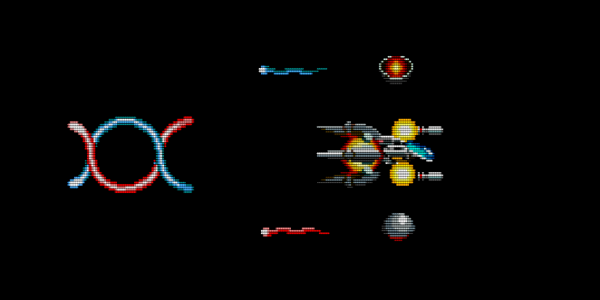

# Irem M72 Core

Implemention of the Irem M72 & M84 arcade hardware (https://www.system16.com/hardware.php?id=738) for the MiSTer FPGA platform.

## Supported Games

|Name|Region|Notes|
|---|---|---|
|[R-Type](https://en.wikipedia.org/wiki/R-Type)|Japan, US, World||
|[Ninja Spirit](https://en.wikipedia.org/wiki/Ninja_Spirit)|Japan||
|[Image Fight](https://en.wikipedia.org/wiki/Image_Fight)|Japan, World||
|[Gallop - Armed Police Unit](https://en.wikipedia.org/wiki/Armed_Police_Unit_Gallop)|Japan|Emulated MCU.|
|[Legend of Hero Tonma](https://en.wikipedia.org/wiki/Legend_of_Hero_Tonma)|Japan||
|[Mr. HELI no Daibouken](https://en.wikipedia.org/wiki/Mr._Heli)|Japan||
|[Air Duel](https://en.wikipedia.org/wiki/Air_Duel)|Japan, World|Conversion from M81 hardware.|
|[Dragon Breed](https://en.wikipedia.org/wiki/Dragon_Breed)|Japan|Conversion from M81 hardware.|
|[X-Multiply](https://en.wikipedia.org/wiki/X_Multiply)|Japan|Conversion from M81 hardware.|
|[Daiku no Gensan](https://en.wikipedia.org/wiki/Hammerin%27_Harry)|Japan|Conversion from M81 hardware. Emulated MCU.|
|[Hammerin' Harry](https://en.wikipedia.org/wiki/Hammerin%27_Harry)|US, Japan|M84 Hardware.|
|[R-Type II](https://en.wikipedia.org/wiki/R-Type_II)|Japan,World|M84 hardware.|

## Video Modes
All of these games output a 256 line signal at 55.02hz, that can be difficult for some consumer CRTs to sync too and the refresh rate can cause irregular scrolling on some digital displays. The core offers three additional refresh rates: 50hz, 57hz and 60hz. These will slow down or speed up gameplay, but sound playback will remain uneffected.

## Pause
The core implements pause functionality. You can bind a pause button and/or enable the "OSD Pause" option in the OSD, which will pause the game whenever the OSD is open. Pause is not something the original hardware supported and certain parts of the graphics state need to be saved and replayed during the paused frame. This may cause slight graphical issues when paused in some situations.

## Thanks
Many people, knowingly or not, contributed to this work.
- @ElectronAsh for the initial verilator version and help with the various KNA ICs
- @furrtek for the KNA70H015(11) reverse engineering https://github.com/furrtek/VGChips/tree/master/Nanao/KNA70H015(11)
- @jotego for the YM2151 implementation and analog adjustment module
- @Ace9921 because I used a lot of his TimePilot'84 code as an example for hooking up inputs and dipswitches
- The people from PLD Archive and https://www.jammarcade.net/ for collecting and archiving schematics and PAL information http://wiki.pldarchive.co.uk/index.php?title=R-Type_(M72)
- @sorgelig for developing and maintaining MiSTer
- @RobertPeip for the v30mz cpu I am using as the basis for the v30
- @sentientsixp for encouraging me to do this
- @atrac17 for schematics and MRAs
- @tdlabac for help with MCU emulation
- @_ShootTheCore for providing audio captures from original M72 hardware
- @gyurco for fixes, optimizations and Hammerin' Harry support.
- The MiSTer FPGA discord server for the helpful advice and support

